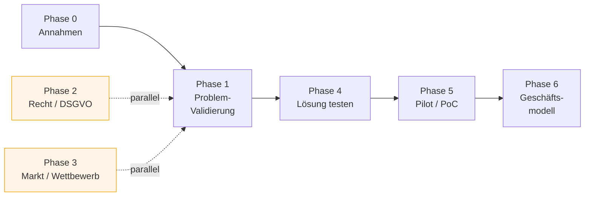
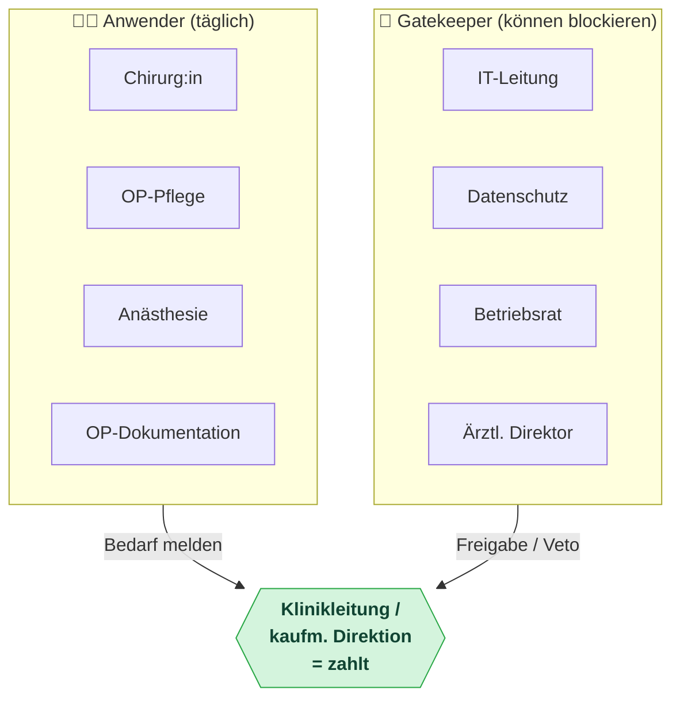

# Audio KI

**Produkt-Idee:** API-basierte Lösung für Operationssäle, die das während einer OP Gesprochene über Mikrofon aufzeichnet, automatisch in Text umwandelt und per API in bestehende Krankenhaus-Software (KIS) integrierbar ist.

**Status:** Discovery / Validierung (vor Entwicklung)

> **Leitprinzip:** Nicht die Technik entscheidet über Erfolg, sondern Workflow-Integration, Regulatorik und der komplexe Einkaufsprozess im Krankenhaus. Dieses Dokument ist ein Discovery-Playbook, um *vor* der Entwicklung herauszufinden, ob die Lösung gebraucht und gekauft wird.

---

## Überblick: Die Phasen auf einen Blick

*Phasen 2 und 3 laufen parallel zur Problem-Validierung — nicht hintereinander.*

---

## Kernannahmen (Assumption Map)

Jede Annahme muss durch Discovery bestätigt oder widerlegt werden. Spalte „Risiko" = Schaden, falls die Annahme falsch ist.

| # | Annahme | Risiko | Status | Wie validiert? |
|---|---------|--------|--------|----------------|
| A1 | OP-Teams *wollen* alles Gesprochene aufgezeichnet haben | Hoch | offen | Problem-Interviews (Phase 1) |
| A2 | OP-Dokumentation ist heute ein echter, quantifizierbarer Schmerzpunkt | Hoch | offen | Problem-Interviews + Zeitmessung |
| A3 | Es ist datenschutz- und medizinrechtlich zulässig | Sehr hoch | offen | Rechts-/DSGVO-Prüfung (Phase 2) |
| A4 | Krankenhäuser haben ein Budget und zahlen dafür | Hoch | offen | LOIs / Pilotverträge (Phase 4) |
| A5 | Spracherkennung funktioniert in echter OP-Akustik (Lärm, Masken, mehrere Sprecher) | Hoch | offen | Pilot / PoC (Phase 5) |
| A6 | Betriebsrat / Beschäftigtendatenschutz blockiert die Aufzeichnung nicht | Hoch | offen | frühe Gespräche (Phase 2) |
| A7 | API-First-Integration ist ein echter Kaufgrund ggü. Insellösungen | Mittel | offen | Solution-Interviews (Phase 4) |
| A8 | Security/Compliance (IEC 81001-5-1, MDR, CRA, DSGVO) ist erfüllbar und wirkt als Verkaufsargument | Hoch | offen | Security-/Rechts-Prüfung (Phase 2) |

---

## Phase 0 — Annahmen explizit machen (≈ 1 Woche)

- [ ] Riskanteste Annahmen aufschreiben (siehe Tabelle oben)
- [ ] Pro Annahme einen Validierungsweg definieren
- [ ] Erfolgs-/Abbruchkriterien grob festlegen

---

## Phase 1 — Problem-Validierung / Customer Discovery (4–6 Wochen)

**Ziel:** Verstehen, ob es ein Problem gibt, das wehtut — noch *keine* Lösung verkaufen.

### Stakeholder kartieren
Im OP gibt es nicht *einen* Kunden:

- **Anwender:** Chirurg:in, OP-Pflege, Anästhesie, OP-Dokumentation
- **Wirtschaftlicher Käufer:** Klinikleitung / kaufmännische Direktion
- **Gatekeeper:** IT-Leitung, Datenschutzbeauftragte:r, Betriebsrat, Ärztlicher Direktor
- **Beeinflusser:** OP-Manager, QM / MDK

*Wer den Schmerz hat (Anwender) und wer zahlt (Leitung) sind verschiedene Personen — und Gatekeeper können alles stoppen. Alle drei musst du adressieren.*

### To-dos
- [ ] 15–25 Problem-Interviews führen (qualitativ, offen)
- [ ] Ist-Zustand der Dokumentation pro Rolle aufnehmen
- [ ] Schmerz quantifizieren (siehe Kennzahlen unten)

### Zu erhebende Kennzahlen
- Minuten Dokumentation pro OP
- Nachdokumentationsquote (wie viel wird erst später nachgetragen?)
- Fehler- und Lückenrate
- Personalkosten der Dokumentation

> **Reality-Check:** „Alles Gesprochene aufzeichnen" ist im OP heikel (Haftung, Stresskommunikation, Betriebsrat, Patientenrechte). Prüfe früh, ob der eigentliche Bedarf nicht **strukturierte Diktat-/OP-Bericht-Erfassung** ist statt einer Total-Aufzeichnung.

---

## Phase 2 — Regulatorik, Datenschutz & Security (parallel zu Phase 1)

Im OP-/Healthcare-Umfeld ein potenzieller Show-Stopper — früh klären.

- [ ] **DSGVO / Patientendaten:** Rechtsgrundlage, Auftragsverarbeitung, Speicherort (EU / On-Prem?), Löschkonzept, **Datenminimierung**
- [ ] **Betriebsrat & Beschäftigtendatenschutz:** Mikrofonaufzeichnung von Mitarbeitenden ist mitbestimmungspflichtig
- [ ] **MDR / Medizinprodukt:** reine Transkription meist *kein* Medizinprodukt — sobald klinische Entscheidungen abgeleitet werden, schon. Grenze sauber definieren
- [ ] **Cybersecurity-Normen prüfen:** **IEC 81001-5-1** (Security vernetzter Medizinprodukte), **MDR**, **Cyber Resilience Act (CRA)**, ggf. **Radio Equipment Directive (RED)**
- [ ] **Schweigepflicht / ggf. TI-Anbindung** je nach Markt
- [ ] Fachkundige Einschätzung einholen (Datenschutz-/Medizinrechtsanwalt + Security)

> Ein „Nein" hier killt das Produkt — das willst du *vor* der Entwicklung wissen.

### Security als Pflicht *und* Verkaufsargument

Patientendaten aus dem OP sind hochsensibel, und im Gesundheitswesen gibt es laut BKA **2–3 schwere Ransomware-Angriffe pro Tag**. Sicherheit „by Design" ist daher kein Nice-to-have, sondern Marktzugang und Differenzierung — gerade für eine **API-Lösung**.

- **3 Schutzziele:** Integrität (Schutz vor Manipulation), Vertraulichkeit (strikte Zugriffskontrolle, Pseudonymisierung/Anonymisierung), Verfügbarkeit (Schutz vor Ausfall/Sabotage/Ransomware)
- **Technisch:** Ende-zu-Ende-Verschlüsselung, **sichere & standardisierte APIs** mit klarer Authentifizierung/Autorisierung, Zero-Trust, rollenbasierte Zugriffe
- **Organisatorisch:** Audit-Trails, Monitoring/Anomalieerkennung, Schulungen, geübte Incident-Response-Pläne
- **Prozess:** **Security by Design / DevSecOps**, „Shift-left" — Sicherheit früh verankern. Spät gefundene Lücken sind technisch, organisatorisch *und* im Zulassungsprozess teurer; früh = bessere Time-to-Market

*(Quelle/Anstoß: Fachbeitrag „Ohne Security keine KI", Manne Kreuzer / TQ-Group, 17.06.2026.)*

---

## Phase 3 — Markt & Wettbewerb (parallel, 2–3 Wochen)

- [ ] **Wettbewerber analysieren:** Nuance Dragon Medical / DAX, Philips SpeechMagic, 3M/Solventum, KIS-Hersteller mit eigenen Modulen
- [ ] Verstehen, *warum* diese im OP noch nicht dominieren → dort liegt die Lücke
- [ ] **Marktgröße (DACH) bottom-up:** Anzahl Häuser × OP-Säle × dokumentationspflichtige Eingriffe
- [ ] **Differenzierung schärfen:** API-First / Embeddable als Wedge — Krankenhäuser wollen keine weitere Insellösung

---

## Phase 4 — Lösung testen, bevor gebaut wird (3–5 Wochen)

- [ ] **Solution-Interviews** mit Mockups / Klick-Prototyp
- [ ] **Wizard-of-Oz-Test:** Standard-Speech-API + manuelle Korrektur, um Akzeptanz ohne Vollprodukt zu messen
- [ ] **Letter of Intent / Pilot-Vorvertrag** anstreben (härtestes Validierungssignal)

> Reden ist billig — Unterschriften nicht. 2–3 LOIs = echter Bedarf.

---

## Phase 5 — Pilot / Proof of Concept (3–6 Monate)

- [ ] 1–2 Referenzkliniken als Design-Partner gewinnen
- [ ] Messbare Erfolgskriterien vorab definieren, z. B.:
  - Dokumentationszeit pro OP −30 %
  - Transkriptionsgenauigkeit > X % bei medizinischer Fachsprache + OP-Geräuschkulisse
- [ ] **Akustik-Risiko adressieren:** OP-Säle sind laut (Sauger, Alarme, mehrere Sprecher, Masken). Erkennungsqualität unter Realbedingungen ist das größte technische Risiko

---

## Phase 6 — Geschäftsmodell & Vertrieb (parallel ab Phase 4)

- [ ] **Pricing-Modell wählen:** pro OP-Saal / pro Transkriptionsminute (API-typisch) / Lizenz pro Haus
- [ ] An eingesparten Kosten ausrichten, nicht an eigenen Kosten
- [ ] **Budgettopf klären:** Investitionsbudget vs. Betriebskosten → bestimmt Länge des Sales-Cycle
- [ ] **Sales-Realität einplanen:** Klinik-Einkauf dauert typischerweise 6–18 Monate

---

## Interview-Leitfaden (Problem-Interviews)

Offen fragen, nach konkreten letzten Vorfällen — **keine** Hypothesen („Würden Sie...?").

1. Beschreiben Sie mir die letzte OP — wie wurde dokumentiert? Wann, von wem?
2. Wie viel Zeit kostet die Dokumentation typischerweise? Wann passiert sie (während/nach der OP)?
3. Was geht dabei regelmäßig schief? Erzählen Sie vom letzten Mal.
4. Was passiert, wenn etwas nicht oder falsch dokumentiert wird?
5. Was haben Sie bisher versucht, um das zu verbessern? Warum hat es (nicht) funktioniert?
6. Wer im Haus ärgert sich am meisten über die aktuelle Lösung?
7. Wie würden Sie zu einer Mikrofon-Aufzeichnung des OP-Gesprächs stehen? Was wären Ihre Bedenken?
8. Wer würde über die Anschaffung einer solchen Lösung entscheiden? Aus welchem Budget?

**Fragetechnik:** zuhören statt pitchen, nach Zahlen und vergangenem Verhalten fragen, Schweigen aushalten.

---

## Go / No-Go — Faustregeln

| Signal | Grünes Licht |
|--------|--------------|
| Problem | Mehrere Häuser nennen denselben quantifizierbaren Schmerz unaufgefordert |
| Regulatorik | Datenschutz/Recht sagt „machbar mit Auflagen" |
| Zahlungsbereitschaft | ≥ 2 LOIs oder bezahlte Piloten |
| Technik | Erkennungsqualität im echten OP > Akzeptanzschwelle der Ärzt:innen |

---

## Wichtigster strategischer Hinweis

Nicht in „alles aufzeichnen" verlieben. Die Interviews entscheiden, ob die Kliniken eine **Total-Aufzeichnung** oder ein **schlankes, KIS-integriertes Sprachdokumentations-API** brauchen. Letzteres ist regulatorisch leichter, wird eher gekauft — und passt genau zum API-First-Ansatz.
