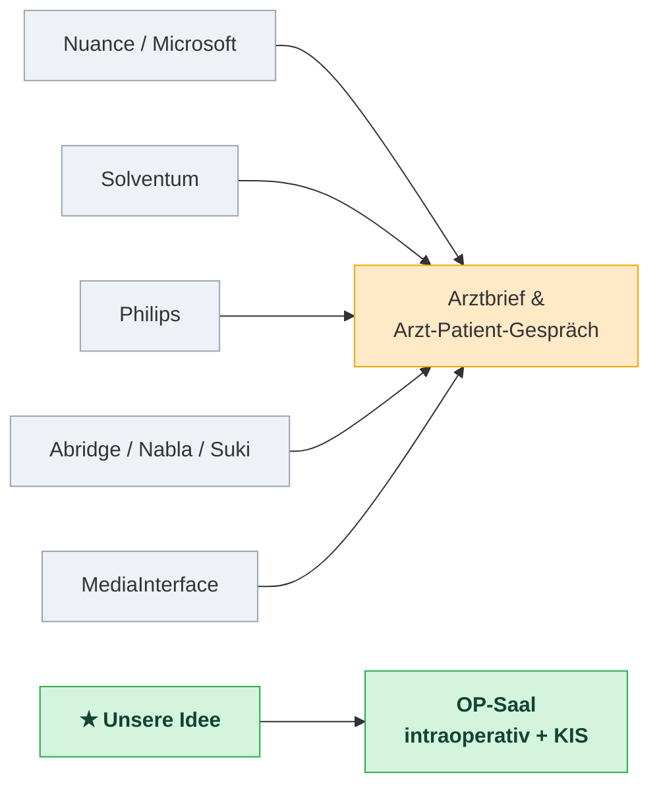
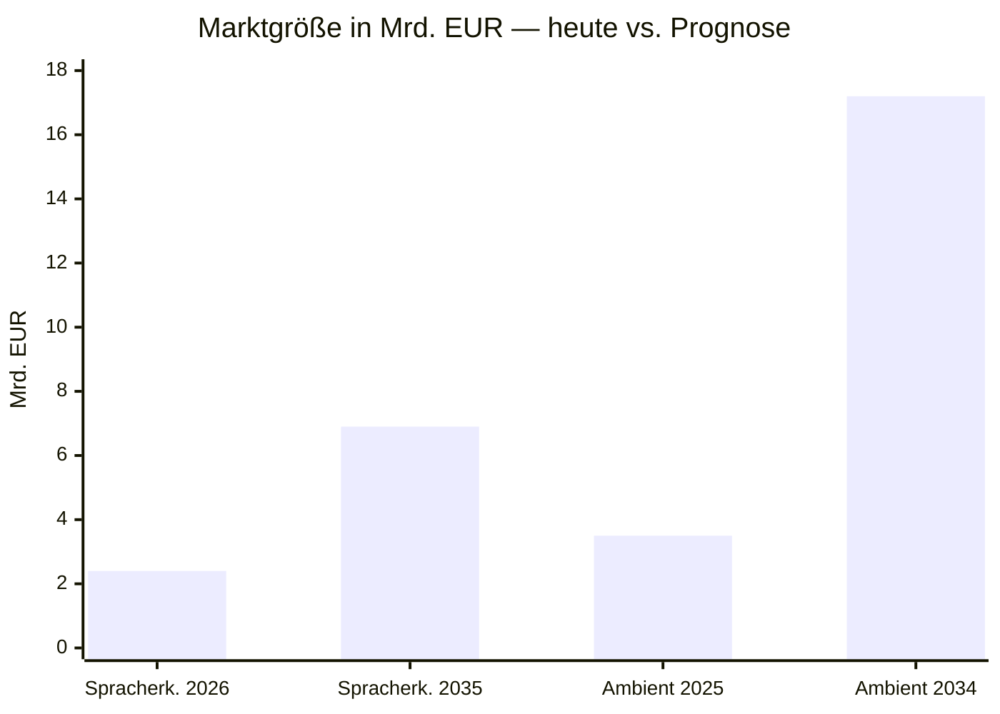

# Folie: Markt & Lücke — Audio KI im OP

> Eine Übersichtsfolie für die GF. Kernbotschaft oben, Beleg in der Mitte, Schlussfolgerung unten.

---

## 🎯 Kernbotschaft

**Ein großer, wachsender Markt — aber den OP-Saal bedient niemand. Genau da wollen wir rein.**

---

## Wer macht heute was?

| Anbieter | Was sie verkaufen | OP-Saal? |
|---|---|:---:|
| **Microsoft / Nuance** (Marktführer) | Arztbrief, Arzt-Patient-Gespräch | ❌ |
| **Solventum** (ehem. 3M) | Doku in die Klinik-Akte | ❌ |
| **Philips** | Sprach-Engine, Befundung | ❌ |
| **Abridge / Nabla / Suki** (Startups) | „Ambient" Arzt-Patient-Doku | ❌ |
| **MediaInterface** (DACH-Player) | Diktat „Made in Germany" | ❌ |
| **ORPHEUS** (IDM / UKE) | Med. Spracherkennung, OP-Berichte | ➖ |
| **➜ Unsere Idee** | **Intraoperative Live-Doku, per API ins KIS** | ✅ |

*➖ = teilweise: ORPHEUS deckt OP-**Berichte per Diktat** ab, aber keine sterile intraoperative Live-Doku und keine belegte KIS-API.*

*Der OP existiert bislang nur als Universitätsforschung (Technische Universität München, Universitätsklinikum Hamburg-Eppendorf) — als Produkt ist er frei.*

*Alle drängen in denselben Topf (orange). Der OP-Saal (grün) ist frei.*

---

## Warum der Markt ernst ist

- 💰 Microsoft kaufte Marktführer **Nuance für ≈ 18 Mrd. €**
- 📈 Markt Spracherkennung Medizin: **~2,4 → 6,9 Mrd. €** (bis 2035)
- 📈 „Ambient"-Doku: **3,5 → 17,2 Mrd. €** (bis 2034)

*Beide Segmente verdrei- bis verfünffachen sich im nächsten Jahrzehnt.*

---

## Warum wir das können — ohne großes Risiko

- 🔌 **Sprach-Engine kaufen wir zu** (fertige API, EU/DSGVO-konform, ~0,006 €/Min) — wir bauen nur den OP-/KIS-Layer
- 🇩🇪 **„Made in Germany / DSGVO"** ist im Klinikmarkt ein Verkaufsargument
- ⏱️ **Fenster ist kurz (~12–24 Monate)** — die Großen wandern langsam Richtung Chirurgie

---

## 👉 Empfehlung

**Gebt mir 6 Wochen, um mit ~8–10 Kliniken zu sprechen. Danach lege ich eine klare Go/No-Go-Empfehlung mit Zahlen vor.**

*Quellen & Details: `wettbewerb.md` · Vorgehen: `onepager-gf.md` · Fahrplan: `fahrplan.md`*
