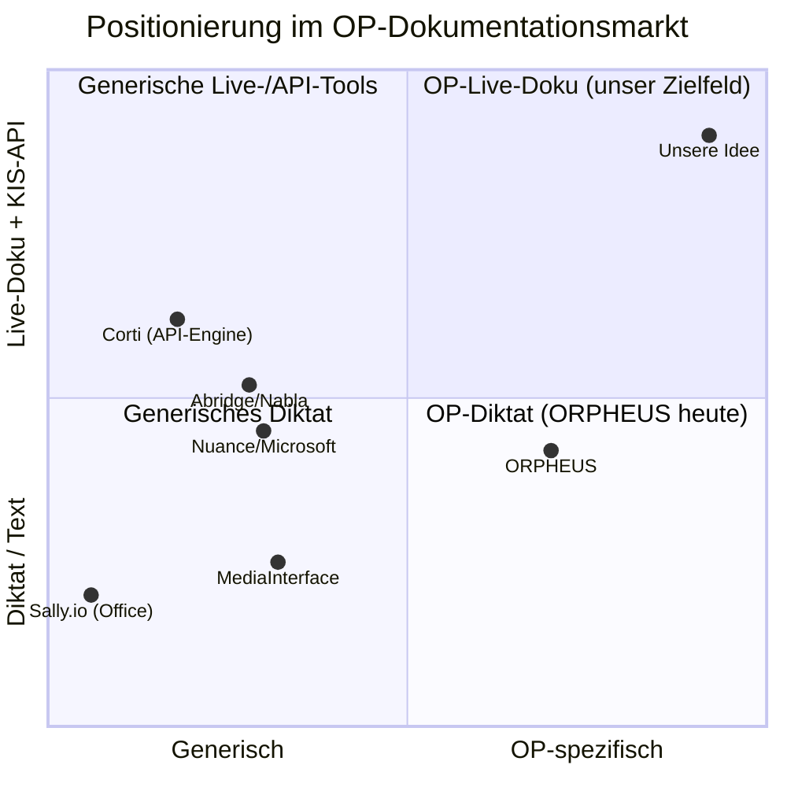

# Markt- & Partneranalyse — Fokus ORPHEUS

*Erstellt für die Geschäftsführung · Stand: Juni 2026 · Vertraulich*

> **Kernaussage:** Wir wollen das Vorhaben über eine **Partner-Integration** umsetzen (Engine in unser System einbinden). Von allen Anbietern steht **ORPHEUS (IDM / Universitätsklinikum Hamburg-Eppendorf)** unserem OP-Use-Case am nächsten und ist unser **Partner-Kandidat A**. Alle großen Marktteilnehmer (Nuance/Microsoft, Solventum, Philips, Abridge …) zielen auf Arztbrief und Arzt-Patient-Gespräch — nicht auf den OP. ORPHEUS deckt den OP bislang nur per **Diktat von OP-Berichten** ab. **Unser Mehrwert in beiden Partner-Szenarien: sterile, intraoperative Live-Doku + echte strukturierte KIS-API.** (Zweiter Partner-Kandidat: Sally.io — sehr anpassbar, aber bisher nur Konferenzen; Details in `kandidaten-orpheus-vs-sally.md`.)

---

## Management Summary

| | |
|---|---|
| **Situation** | Der Markt für medizinische Spracherkennung wächst stark; im OP-Saal gibt es bislang keine vollständige Lösung. Wir wollen nicht alles selbst bauen, sondern eine Engine integrieren. |
| **Befund** | **ORPHEUS** ist der reifste, dem OP nächste Anbieter (Universitätsklinikum Hamburg-Eppendorf + 30+ Kliniken, DE-souverän) — adressiert den OP aber nur per **nachgelagertem Diktat**, ohne sterile Live-Doku und ohne belegte strukturierte KIS-API. |
| **Chance** | Genau diese Punkte — **intraoperative Live-Doku** und **echte API** — ergänzen **wir** als eigenen Layer auf der Partner-Engine. Derzeit unbesetzt. |
| **Empfehlung** | Vorhaben als **Partner-Integration** aufsetzen: Gespräche mit **ORPHEUS** (klinisch reif) und **Sally.io** (sehr anpassbar) führen und den eigenen **OP-Live-/KIS-Layer** als Mehrwert definieren. Zeitfenster ~12–24 Monate. |
| **Nächster Schritt** | Beide Partner kontaktieren (Fragen siehe `kandidaten-orpheus-vs-sally.md`) und Mehrwert in den Klinik-Interviews gegentesten. |

*Methodik & Belege: Aussagen sind als **[BELEGT]** (durch Quelle gedeckt) bzw. **[EINSCHÄTZUNG]** (eigene Bewertung) gekennzeichnet — bewusst transparent, damit die GF Faktenlage und Interpretation trennen kann. Quellen am Ende.*

---

## 1. Warum ORPHEUS im Rampenlicht steht

| Grund | Bedeutung für uns |
|---|---|
| **Nächster am Use-Case** | Einziger Player mit explizitem OP-Bezug (OP-Berichte). Unser direktester Vergleichsmaßstab. |
| **Hohe Reife** | Produktiv an UKE + 30+ Kliniken + 200+ ambulanten Einrichtungen, ~4,5 Mio. Audiodateien. Kein Prototyp. |
| **DE-souverän** | Betrieb ausschließlich in Deutschland (on-prem / STACKIT / GWDG), DSGVO — genau das DACH-Verkaufsargument. |
| **Gemeinnützig & offen** | IDM stellt Anwendungen explizit anderen Kliniken bereit → potenzieller **Partner/Baustein**, nicht nur Gegner. |

→ Wer in DACH eine OP-Sprachlösung baut, **misst sich an ORPHEUS** — und sollte früh entscheiden: konkurrieren, partnern oder darauf aufbauen.

---

## 2. ORPHEUS im Detail

**Anbieter:** IDM gGmbH (Innovative Digitale Medizin), gemeinnützige UKE-Ausgründung, gegr. 2024. **[BELEGT]**

### Stärken 💪
- **Medizinisch trainiert:** erkennt Fachterminologie + Alltagssprache, für alle Berufsgruppen. **[BELEGT]**
- **Bewährt im Echtbetrieb:** seit Anfang 2025 produktiv am UKE (~15.000 Mitarbeitende), breite Klinik-Verbreitung. **[BELEGT]**
- **Datensouveränität:** kein internationaler Cloud-Dienst; on-prem oder DE-Cloud; DSGVO. **[BELEGT]**
- **Niedrige Integrationshürde:** schreibt „an jeder Cursorposition" in jedes KIS/PVS/Word/E-Mail — keine Konnektoren nötig. **[BELEGT]**
- **Roadmap-Tiefe:** Schwesterprodukt **ARGO** generiert Arztbrief-/Epikrise-Entwürfe → IDM geht über reine Spracherkennung hinaus. **[BELEGT]**

### Schwächen / Lücken 🎯 (= unsere Chance)
- **Keine sterile, intraoperative Live-Doku:** OP-**Berichte** werden (nach-)diktiert; eine hands-free Live-Erfassung im sterilen OP-Saal ist **nicht belegt**. **[BELEGT/EINSCHÄTZUNG]**
- **Keine belegte strukturierte API:** „Cursor-überall" ist universelle Texteingabe, aber **keine HL7/FHIR-API** für strukturierten KIS-Datenfluss im Material. **[BELEGT/EINSCHÄTZUNG]**
- **Generalist statt OP-Spezialist:** breite Klinikabdeckung, aber kein Fokus auf OP-Akustik (Lärm, Masken, mehrere Sprecher, Distanzmikro). **[EINSCHÄTZUNG]**
- **Keine öffentlichen Preise / kein API-First-Vertriebsmodell** erkennbar. **[BELEGT]**

---

## 3. ORPHEUS vs. der Rest des Marktes

| Anbieter | Fokus | OP-Saal | KIS-Integration | DE/EU-Hosting | Reife |
|---|---|:---:|---|:---:|---|
| **★ ORPHEUS (IDM/UKE)** | **Med. Spracherkennung** | **Teilw.** (Berichte) | „Cursor-überall"; API unklar | **Ja (DE)** | **Hoch** |
| Nuance / Microsoft | Arztbrief, Ambient | Nein | EHR-integriert | teils | Sehr hoch |
| Solventum (3M) | Doku in die Akte | Nein | EHR-integriert | teils | Hoch |
| Philips | Sprach-Engine, Befundung | Nein | Engine/SaaS | teils | Hoch |
| Abridge / Nabla / Suki | Ambient Arzt-Patient | Nein | EHR-integriert | meist nein | Hoch (US) |
| MediaInterface | Diktat „Made in Germany" | Nein | KIS-integriert | Ja (DE) | Hoch (DACH) |
| Corti (Engine) | Reine Med-STT-**API** | Nein | API-Baustein | Ja (EU) | Mittel |
| **➜ Unsere Idee** | **OP-Live-Doku** | **Ja** | **Strukturierte API** | **Ja (DE/EU)** | Konzept |

---

## 4. Positionierungs-Matrix

*ORPHEUS ist heute unten-rechts (OP, aber Diktat). Unser Zielfeld ist oben-rechts (OP-Live-Doku + API) — frei.* **[EINSCHÄTZUNG]**

---

## 5. Head-to-Head: ORPHEUS vs. unsere Lösung

| Merkmal | ORPHEUS | Unsere geplante Lösung |
|---|---|---|
| Erfassung | (Nach-)Diktat von OP-Berichten | **Live-Erfassung im OP, hands-free/steril** |
| OP-Akustik | nicht spezialisiert | **auf OP optimiert** (Lärm, Masken, Mehrsprecher) |
| KIS-Anbindung | Texteingabe „an Cursor" | **strukturierte API (HL7/FHIR), embeddable** |
| Datensouveränität | DE-only, on-prem | **DE/EU, Security by Design** (gleichwertig) |
| Reife | produktiv, breit | Konzept (Aufholbedarf) |
| Vertrieb | Klinik-Direkt | **API-First, in eure Software integriert** |

**Lesart:** Wir gewinnen *nicht* über „besseres Diktat" (da ist ORPHEUS reif und etabliert), sondern über **das, was ORPHEUS nicht tut**: integrierte, sterile Live-Dokumentation im OP plus echte API. **[EINSCHÄTZUNG]**

---

## 6. Strategische Optionen gegenüber ORPHEUS

| Option | Idee | Pro | Contra |
|---|---|---|---|
| **A — Konkurrieren** | Eigene OP-Live-Lösung gegen ORPHEUS positionieren | volle Differenzierung, eigener Moat | ORPHEUS ist reif & vertraut; langer Aufholweg |
| **B — Partnern** | Mit IDM kooperieren (sie liefern Engine/Klinikzugang, wir den OP-/API-Layer) | schneller Marktzugang, IDM ist gemeinnützig/offen | Abhängigkeit, Wertaufteilung |
| **C — Aufbauen** | ORPHEUS (oder Corti) als zugekaufte Engine, wir bauen nur OP-/KIS-Layer | wir bauen Sprach-Engine nicht selbst, Fokus auf Differenzierung | Engine-Lieferant kann zum Wettbewerber werden |

**Empfehlung [EINSCHÄTZUNG]:** Mit **Option B/C beginnen** (Gespräch mit IDM suchen) und parallel die **Differenzierung A** schärfen. Konkret: IDM-Gespräch führen (siehe offene Fragen), gleichzeitig den eigenen OP-Live-/API-Layer als Kern-Moat definieren — unabhängig davon, wessen Sprach-Engine darunter läuft.

---

## 7. Risiken

- **ORPHEUS schließt die Lücke selbst:** IDM könnte Live-OP-Doku + API auf die Roadmap nehmen (ARGO zeigt Tempo). → **Zeitfenster ~12–24 Monate.** **[EINSCHÄTZUNG]**
- **Microsoft/Nuance** drängt mittelfristig Richtung Chirurgie. **[EINSCHÄTZUNG]**
- **Reife-Vorsprung:** ORPHEUS hat Vertrauen und Klinikbeziehungen, die wir erst aufbauen müssen. **[BELEGT/EINSCHÄTZUNG]**

---

## 8. Offene Fragen an IDM (Partner-/Wettbewerbs-Check)
1. Gibt es eine **echte strukturierte API (HL7/FHIR)** über das „Cursor-überall"-Modell hinaus?
2. Wie verhält sich die Engine unter **realer OP-Akustik** und für **sterile, hands-free Live-Doku**?
3. **Lizenz-/Partnermodell und Preise** für eine Einbettung in unsere Software?
4. Ist eine **Kooperation** (Engine + Klinikzugang gegen unseren OP-/API-Layer) denkbar?

---

### Quellen (Auswahl)
IDM/ORPHEUS: idmedizin.de · medinfoweb.de · heise.de (UKE-Ausgründung KI-Sprachmodell) · uke.de (Digitale Helfer 2026; ARGO-PM) · gesundheitswirtschaft.at (DACH-Marktüberblick). Markt/Wettbewerb: siehe `wettbewerb.md`. Kandidaten-Detail: siehe `kandidaten-orpheus-vs-sally.md`.
*Hinweis: Mehrere Quellen lieferten beim direkten Abruf HTTP 403; Fakten aus konsistenten Suchindex-Snippets. Für ein Partnergespräch direkt bei IDM verifizieren.*
