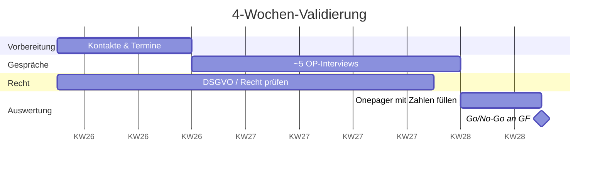
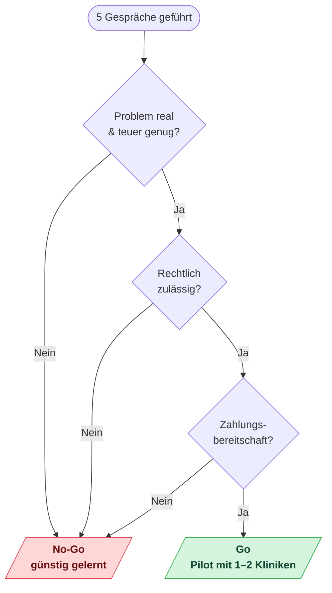

# Audio KI im OP — Vorschlag für die Geschäftsführung

> **Worum es geht:** Bitte um Freigabe für eine 4-wöchige Validierung. Ich will herausfinden, ob sich die Lösung lohnt — *bevor* wir entwickeln. Geringes Risiko, schnelle Antwort.

---

## 1. Das Problem
*(In 1–2 Sätzen, was im OP heute konkret nervt. Trag hier nach den ersten Gesprächen echte Zahlen/Zitate ein.)*

> _Beispiel: „Chirurg:innen verbringen pro OP X Minuten mit Dokumentation, oft erst Stunden später aus dem Gedächtnis. Das kostet Zeit, ist fehleranfällig und unbeliebt."_

- Doku-Zeit pro OP: **___ Min.**
- Nachdokumentationsquote: **___ %**
- Geschätzte Kosten/Jahr pro OP-Saal: **___ €**

---

## 2. Die Idee
Das im OP Gesprochene wird per Mikrofon aufgezeichnet, automatisch in Text umgewandelt und **per API direkt in unsere bestehende Software** integriert. Kein weiteres Insel-System.

---

## 3. Warum wir das jetzt prüfen
- **Markt wächst stark:** medizinische Spracherkennung ~2,6 → 7,5 Mrd. USD bis 2035; „Ambient"-Dokumentation 3,8 → 18,6 Mrd. USD bis 2034. Microsoft kaufte Nuance für 19,7 Mrd. USD — der Markt ist ernst.
- **Es gibt eine Lücke beim OP:** Alle großen Anbieter (Nuance/Microsoft, Solventum, Philips, Abridge) zielen auf Arztbrief und Arzt-Patient-Gespräch — **nicht** auf den Operationssaal. Der OP-Use-Case ist bislang nur Forschung/Einzellösung, kein Produkt. **Fenster ist kurz (~12–24 Monate).**
- **Passt zu uns:** Die Sprach-Engine müssen wir nicht selbst bauen (gibt es als API, z. B. Corti, EU/DSGVO-konform). Unser Wert liegt in der **OP-/KIS-Integration** — genau unser API-First-Ansatz. „Made in Germany / DSGVO" ist im DACH-Markt ein Verkaufsargument.

*(Details & Quellen: siehe `wettbewerb.md`)*

---

## 3a. „Wenn die Lücke so gut ist — warum macht es niemand?" (erwartete Rückfrage)

Wichtig: Die Lücke ist frei, **weil der OP schwer ist — nicht, weil es sich nicht lohnt.**

- **Technisch härter:** Lärm, Mikrofon-Abstand, Masken, mehrere Sprecher, Sterilität. Die Großen haben sich erst die einfachen, großen Töpfe geholt (Arztbrief, Arzt-Patient-Gespräch). → Eine hohe Hürde ist für uns ein **Schutz**, kein Ausschlusskriterium.
- **Timing, nicht Desinteresse:** Die Großen wandern erkennbar Richtung Chirurgie — wir sind nur früher dran. → **Fenster ~12–24 Monate.**
- **Regulatorik/Kultur sind im OP heikler** (Haftung, Betriebsrat, Patientenrechte). Das ist das **echte Risiko** — möglich, dass der Bedarf eher „strukturierte OP-Berichte per Sprache" ist als „alles aufzeichnen". Genau das klären die Gespräche.
- **Bedarf ist bereits sichtbar:** Eine Klinik (UKE) hat sich selbst eine Lösung gebaut (ORPHEUS); eine Studie zeigt vollständigere OP-Berichte durch Direktdiktat; die TU München forscht daran; 98 % einer Umfrage halten OP-Sprachtechnik für wünschenswert.

**Kurz:** Leere Lücke = beste Art von Chance, *solange* die Gespräche Zahlungsbereitschaft und den richtigen Zuschnitt (Total-Aufzeichnung vs. OP-Bericht) bestätigen.

---

## 4. Was ich als Nächstes tue
**In den nächsten 4 Wochen:** Gespräche mit ca. 5 Kliniken/OP-Teams, um zu klären:
1. Ist das Problem real und teuer genug?
2. Ist es datenschutz-/rechtlich zulässig?
3. Würde jemand dafür zahlen?

**Ergebnis:** klare Go/No-Go-Empfehlung mit Zahlen.

### Zeitplan (4 Wochen)

### So fällt die Entscheidung

---

## 5. Was ich von euch brauche
- [ ] **Zeit:** ~4 Wochen / X Tage meiner Kapazität
- [ ] **Budget:** gering / kein Entwicklungsbudget nötig in dieser Phase
- [ ] **Kontakte:** ein bis zwei Klinik-Kontakte aus eurem Netzwerk wären Gold wert

---

## Die Entscheidung für euch
> Kein „Lasst uns das bauen" — sondern „Gebt mir 4 Wochen, dann weiß ich, ob es sich lohnt." Risikoarm, mit klarem Ergebnis.

---

### Backup / Details
Vollständiger Validierungs-Fahrplan, Annahmen, Interview-Leitfaden und Go/No-Go-Kriterien: siehe `audio-ki.md`.
